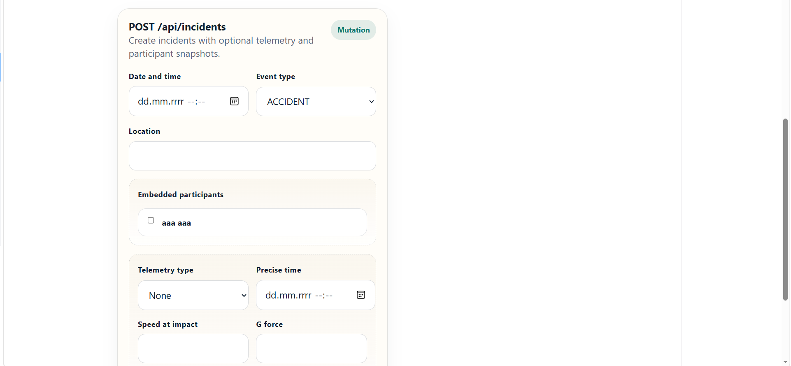
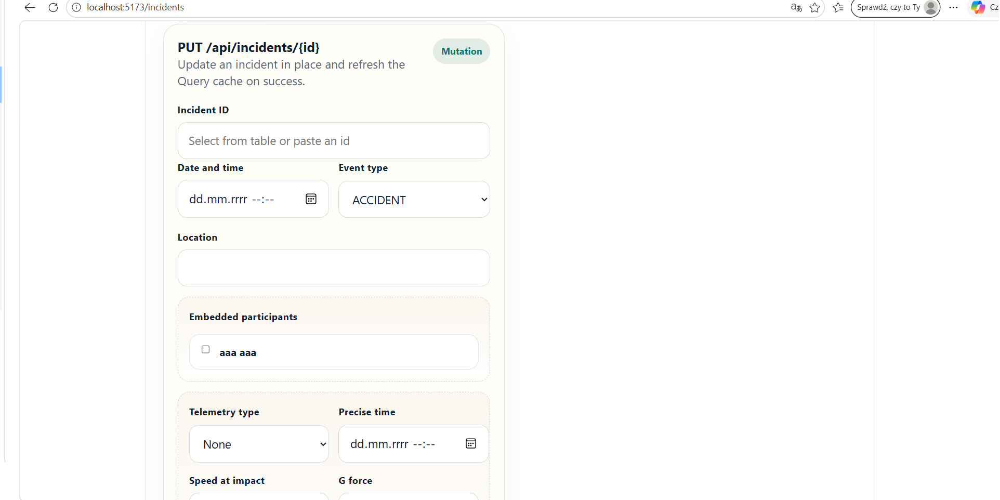

# CarMonitoring

CarMonitoring monorepo with a React frontend and two backend implementations (Node.js and Java Spring Boot).

## What This Application Is For

CarMonitoring is used to register road accidents with participant roles such as victim, witness, and perpetrator. It is designed to support case handling workflows for police officers and lawyers.

## Screenshots

### Create Incident



### Get Incidents


### Update Incident



## Project Structure

- `frontend` - React + TypeScript + Vite
- `node-server` - Express + TypeScript + PostgreSQL
- `server-java` - Spring Boot + JPA + PostgreSQL

## Tech Stack

### Frontend
- React 19
- TypeScript
- Vite
- TanStack Query
- Axios

### Backend (Node)
- Node.js
- Express
- TypeScript
- pg (PostgreSQL)

### Backend (Java)
- Java 17
- Spring Boot
- Spring Data JPA
- PostgreSQL
- MapStruct

## Prerequisites

- Node.js 18+
- npm 9+
- Java 17+
- Maven (or use Maven Wrapper from `server-java`)
- PostgreSQL

## Quick Start

### 1. Frontend

```bash
cd frontend
npm install
npm run dev
```

Default: Vite dev server on `http://localhost:5173`

### 2. Backend (choose one)

Run one backend at a time, because both are configured to use port `8080` by default.

#### Option A: Node server

```bash
cd node-server
npm install
npm run dev
```

The server reads port from `process.env.PORT` and falls back to `8080`.

#### Option B: Java server

```bash
cd server-java
./mvnw spring-boot:run
```

On Windows:

```bash
cd server-java
mvnw.cmd spring-boot:run
```

Server default port: `8080`.

## API Endpoints

Both backends expose equivalent REST resources:

- `GET /api/incidents`
- `GET /api/incidents/{id}`
- `POST /api/incidents`
- `PUT /api/incidents/{id}`
- `DELETE /api/incidents/{id}`

- `GET /api/participants`
- `GET /api/participants/{id}`
- `POST /api/participants`
- `PUT /api/participants/{id}`
- `DELETE /api/participants/{id}`

## Build Commands

### Frontend

```bash
cd frontend
npm run build
```

### Node server

```bash
cd node-server
npm run build
```

### Java server

```bash
cd server-java
./mvnw clean package
```

On Windows:

```bash
cd server-java
mvnw.cmd clean package
```

## Notes

- Frontend expects backend API under `http://localhost:8080`.
- If needed, update backend port or frontend API base URLs accordingly.
- For Java backend database settings, check `server-java/src/main/resources/application.properties`.
